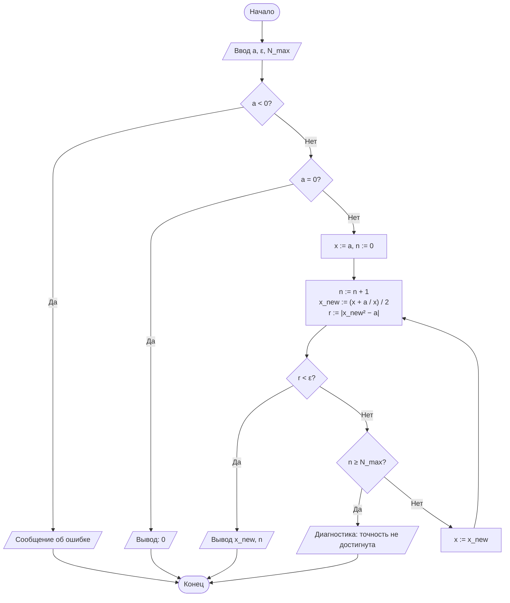
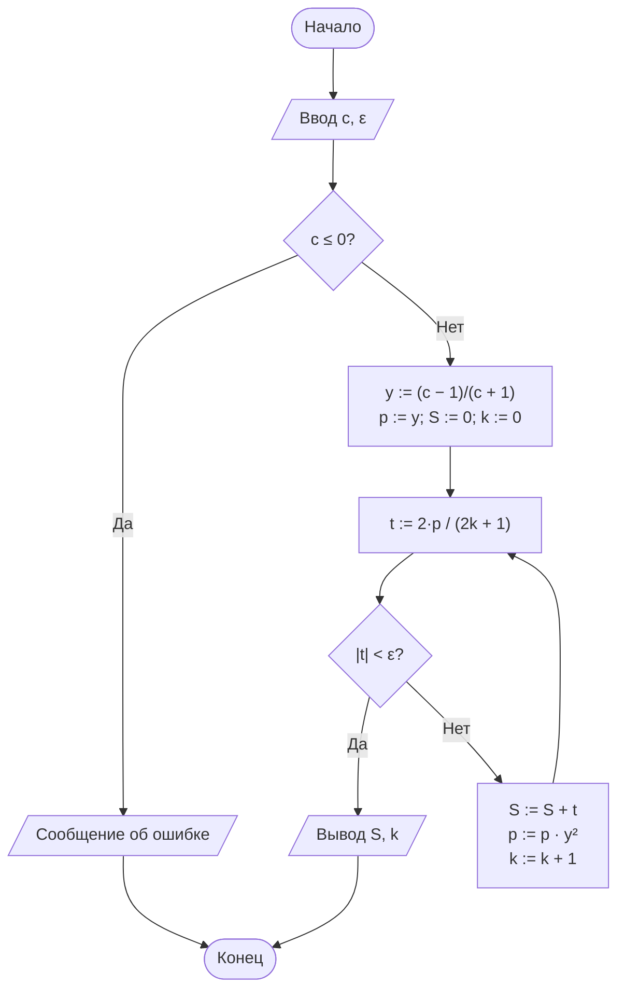

# Лабораторная работа № 1

## Итерационные методы вычисления элементарных функций: квадратный корень, кубический корень и натуральный логарифм

**Дисциплина:** Теория алгоритмов
**Направление подготовки:** 38.03.05 «Бизнес-информатика»
**Курс:** 2
**Вариант:** 14
**Язык реализации:** Python 3.10+

---

## 1. Цель и задачи работы

**Цель работы:** сформировать представление об итерационных алгоритмах как о классе вычислительных процедур, результат которых достигается последовательным уточнением приближений, и освоить приёмы оценки их сходимости и трудоёмкости.

**Задачи:**

1. Изучить понятия итерационного процесса, начального приближения, критерия остановки и скорости сходимости.
2. Реализовать алгоритмы вычисления $\sqrt{a}$ и $\sqrt[3]{b}$ методом Ньютона, а также $\ln c$ методом разложения в степенной ряд.
3. Экспериментально определить число итераций, необходимое для достижения заданной точности $\varepsilon$.
4. Сравнить полученные значения с эталонными значениями стандартной библиотеки (`math`) и оценить абсолютную погрешность.
5. Выполнить дополнительное требование **Д4**: ввести ограничение $N_{\max}$, реализовать корректное завершение алгоритма с диагностическим сообщением при недостижении точности и определить минимальное значение $N_{\max}$, достаточное для своего варианта.

---

## 2. Задание своего варианта

**Исходные данные (вариант 14):**

| Параметр | Значение |
|---|---|
| $a$ (для $\sqrt{a}$) | 37 |
| $b$ (для $\sqrt[3]{b}$) | −125 |
| $c$ (для $\ln c$) | 12 |
| $\varepsilon$ | $10^{-6}$ |
| Критерий остановки (для корней) | **по невязке**: $\lvert F(x_n)\rvert < \varepsilon$ |
| Начальное приближение $x_0$ | $x_0 = a$ (то есть $x_0$ равно значению аргумента; для кубического корня — модулю аргумента) |
| Дополнительное требование | **Д4** |

**Формулировка Д4:** ввести ограничение $N_{\max} = 5$; реализовать корректное завершение с диагностическим сообщением, если точность не достигнута; определить минимальное $N_{\max}$, достаточное для своего варианта.

Поскольку критерий для корней — «по невязке», условие остановки:

- для $\sqrt{a}$: $\bigl\lvert x_{n+1}^2 - a \bigr\rvert < \varepsilon$;
- для $\sqrt[3]{b}$: $\bigl\lvert x_{n+1}^3 - \lvert b\rvert \bigr\rvert < \varepsilon$ (метод применяется к $\lvert b \rvert$, знак восстанавливается в конце).

Для логарифма критерий остановки всегда один: $\lvert t_k \rvert < \varepsilon$, где $t_k$ — очередной член ряда.

---

## 3. Краткие теоретические сведения

### 3.1. Метод Ньютона

Для решения $F(x)=0$ строится последовательность

$$x_{n+1} = x_n - \frac{F(x_n)}{F'(x_n)}.$$

**Квадратный корень.** $F(x)=x^2-a \Rightarrow$

$$x_{n+1} = \frac{1}{2}\left(x_n + \frac{a}{x_n}\right) \quad \text{(формула Герона).}$$

**Кубический корень.** $F(x)=x^3-b \Rightarrow$

$$x_{n+1} = \frac{1}{3}\left(2x_n + \frac{b}{x_n^2}\right).$$

Метод Ньютона обладает квадратичной сходимостью ($p=2$): число верных знаков примерно удваивается на каждой итерации.

### 3.2. Ряд для натурального логарифма

$$\ln c = 2\left(y + \frac{y^3}{3} + \frac{y^5}{5} + \ldots\right), \qquad y=\frac{c-1}{c+1},$$

сходится при любом $c>0$, но линейно ($p=1$); число итераций растёт с приближением $\lvert y\rvert$ к единице. Для $c=12$ имеем $y = 11/13 \approx 0{,}846$ — значение $\lvert y \rvert$ близко к 1, поэтому ожидается заметно больше итераций, чем в примере с $c=5$.

### 3.3. Критерий «по невязке» и ограничение $N_{\max}$

Критерий по невязке проверяет не близость соседних приближений, а насколько текущее приближение удовлетворяет исходному уравнению: $\lvert F(x_n)\rvert < \varepsilon$. Ограничение $N_{\max}$ — техническая страховка: без него алгоритм с медленной или отсутствующей сходимостью работал бы бесконечно. При исчерпании $N_{\max}$ без достижения точности необходимо корректно завершить работу и сообщить об этом пользователю, а не выдавать неверный результат как окончательный.

---

## 4. Блок-схемы алгоритмов

### 4.1. Квадратный корень (критерий — по невязке)



### 4.2. Кубический корень

Строится аналогично схеме для $\sqrt{a}$. Отличия: в начале выделяется знак $b$ и метод применяется к $\lvert b \rvert$; итерационная формула $x_{\text{new}} := (2x + b/x^2)/3$; невязка $r := \lvert x_{\text{new}}^3 - \lvert b\rvert \rvert$; перед выводом восстанавливается знак результата.

### 4.3. Натуральный логарифм



---

## 5. Листинг программы

```python
"""
Лабораторная работа №1. Вариант 14.
Итерационные методы вычисления sqrt(a), cbrt(b), ln(c).
Критерий остановки для корней: по невязке |F(x)| < eps.
Дополнительное требование Д4: ограничение N_max, диагностика при
недостижении точности, поиск минимального достаточного N_max.
"""
import math


class PrecisionNotReached(Exception):
    """Точность не достигнута за отведённое число итераций."""
    def __init__(self, n_max, last_x, last_residual):
        self.n_max = n_max
        self.last_x = last_x
        self.last_residual = last_residual
        super().__init__(
            f"Точность не достигнута за N_max={n_max} итераций "
            f"(последнее x={last_x!r}, невязка={last_residual:.3e})"
        )


def sqrt_newton(a, eps=1e-6, n_max=100):
    """Квадратный корень методом Ньютона (формула Герона).
    Критерий остановки — по невязке: |x_new^2 - a| < eps."""
    if a < 0:
        raise ValueError("Подкоренное выражение должно быть неотрицательным")
    if a == 0:
        return 0.0, 0
    x = a if a >= 1 else 1.0
    for n in range(1, n_max + 1):
        x_new = 0.5 * (x + a / x)
        residual = abs(x_new * x_new - a)
        if residual < eps:
            return x_new, n
        x = x_new
    raise PrecisionNotReached(n_max, x, residual)


def cbrt_newton(b, eps=1e-6, n_max=100):
    """Кубический корень методом Ньютона (с учётом знака).
    Критерий остановки — по невязке: |x_new^3 - |b|| < eps."""
    if b == 0:
        return 0.0, 0
    sign = -1 if b < 0 else 1
    bb = abs(b)
    x = bb if bb >= 1 else 1.0
    for n in range(1, n_max + 1):
        x_new = (2 * x + bb / (x * x)) / 3
        residual = abs(x_new ** 3 - bb)
        if residual < eps:
            return sign * x_new, n
        x = x_new
    raise PrecisionNotReached(n_max, sign * x, residual)


def ln_series(c, eps=1e-6, n_max=10_000):
    """Натуральный логарифм рядом ln c = 2*(y + y^3/3 + y^5/5 + ...),
    y = (c-1)/(c+1). Критерий остановки — по модулю члена ряда: |t_k| < eps."""
    if c <= 0:
        raise ValueError("Аргумент логарифма должен быть положительным")
    y = (c - 1) / (c + 1)
    y2 = y * y
    power = y
    total = 0.0
    for k in range(n_max):
        term = 2 * power / (2 * k + 1)
        if abs(term) < eps:
            return total, k
        total += term
        power *= y2
    raise PrecisionNotReached(n_max, total, abs(term))


def find_min_n_max(func, arg, eps):
    """Подбор минимального N_max, достаточного для достижения eps."""
    n = 1
    while True:
        try:
            _, iters = func(arg, eps, n)
            return iters
        except PrecisionNotReached:
            n += 1


if __name__ == "__main__":
    a, b, c = 37, -125, 12
    eps = 1e-6
    N_MAX = 5  # ограничение по Д4

    print("=== Расчёт с ограничением N_max = 5 ===\n")
    for name, func, arg in [("sqrt(37)", sqrt_newton, a),
                             ("cbrt(-125)", cbrt_newton, b),
                             ("ln(12)", ln_series, c)]:
        try:
            val, n = func(arg, eps, N_MAX)
            print(f"{name}: результат={val}, итераций={n}")
        except PrecisionNotReached as e:
            print(f"{name}: ОШИБКА — {e}")

    print("\n=== Минимальное достаточное N_max (eps = 1e-6) ===\n")
    for name, func, arg in [("sqrt(37)", sqrt_newton, a),
                             ("cbrt(-125)", cbrt_newton, b),
                             ("ln(12)", ln_series, c)]:
        print(f"{name}: N_max(min) = {find_min_n_max(func, arg, eps)}")

    print("\n=== Итоговый расчёт с достаточным N_max ===\n")
    header = f"{'Функция':<12}{'Аргумент':>10}{'Результат':>18}{'Эталон':>18}{'Погрешность':>14}{'Итераций':>10}"
    print(header)
    for name, func, arg, ref in [
        ("sqrt", sqrt_newton, a, math.sqrt(a)),
        ("cbrt", cbrt_newton, b, math.copysign(abs(b) ** (1 / 3), b)),
        ("ln", ln_series, c, math.log(c)),
    ]:
        val, n = func(arg, eps, 1000)
        err = abs(val - ref)
        print(f"{name:<12}{arg:>10}{val:>18.10f}{ref:>18.10f}{err:>14.2e}{n:>10}")
```

---

## 6. Результаты расчётов

### 6.1. Работа с ограничением $N_{\max}=5$ (Д4)

При $N_{\max}=5$ ни один из трёх алгоритмов не достигает заданной точности $\varepsilon = 10^{-6}$ — программа корректно завершается диагностическим сообщением вместо выдачи неверного результата как окончательного:

| Функция | Сообщение программы |
|---|---|
| $\sqrt{37}$ | Точность не достигнута за N_max=5 итераций (последнее x≈6,08306028, невязка≈3,622·10⁻³) |
| $\sqrt[3]{-125}$ | Точность не достигнута за N_max=5 итераций (последнее x≈−16,55754511, невязка≈4,414·10³) |
| $\ln 12$ | Точность не достигнута за N_max=5 итераций (последнее S≈2,40783793, невязка≈4,941·10⁻²) |

### 6.2. Минимальное достаточное $N_{\max}$ для $\varepsilon=10^{-6}$

| Функция | Минимальное $N_{\max}$ |
|---|---|
| $\sqrt{37}$ | **6** |
| $\sqrt[3]{-125}$ | **12** |
| $\ln 12$ | **31** |

### 6.3. Итоговые результаты (с достаточным $N_{\max}$)

**Таблица результатов вычислений (вариант 14, $\varepsilon = 10^{-6}$, критерий — по невязке)**

| Функция | Аргумент | Результат | Эталон (`math`) | Абс. погрешность | Число итераций |
|---|---|---|---|---|---|
| $\sqrt{a}$ | 37 | 6,0827625376 | 6,0827625303 | $7{,}29 \cdot 10^{-9}$ | 6 |
| $\sqrt[3]{b}$ | −125 | −5,0000000000 | −5,0000000000 | $6{,}90 \cdot 10^{-13}$ | 12 |
| $\ln c$ | 12 | 2,4849038501 | 2,4849066498 | $2{,}80 \cdot 10^{-6}$ | 31 |

### 6.4. Таблица итераций для $\sqrt{37}$ (иллюстрация квадратичной сходимости)

| $n$ | $x_n$ | Невязка $\lvert x_n^2-37\rvert$ |
|---|---|---|
| 1 | 19,0000000000 | 324,000000 |
| 2 | 10,4736842105 | 72,698061 |
| 3 | 7,0031737636 | 12,044443 |
| 4 | 6,1432463100 | 0,739475 |
| 5 | 6,0830602790 | 0,003622 |
| 6 | 6,0827625376 | $8{,}86 \cdot 10^{-8}$ |

---

## 7. Анализ результатов и выводы

1. Все три алгоритма при достаточном $N_{\max}$ достигли заданной точности $\varepsilon = 10^{-6}$ по критерию невязки. Фактическая погрешность метода Ньютона (столбцы «Абс. погрешность» для $\sqrt{a}$ и $\sqrt[3]{b}$) на несколько порядков меньше $\varepsilon$ — прямое следствие квадратичной сходимости: как только невязка опускается ниже $\varepsilon$, истинная ошибка $\lvert x_n - x^*\rvert$ уже пренебрежимо мала (табл. 6.4 наглядно показывает, что число верных знаков растёт лавинообразно: с 5-й на 6-ю итерацию невязка падает с $3{,}6 \cdot 10^{-3}$ до $8{,}9 \cdot 10^{-8}$).
2. Кубический корень потребовал вдвое больше итераций (12), чем квадратный (6), несмотря на схожую квадратичную природу метода — сказалось удалённое начальное приближение $x_0=125$ при $x^*=5$: на первых шагах убывание идёт медленно (почти линейно), квадратичный режим включается лишь вблизи корня.
3. Ряд для $\ln 12$ сошёлся за 31 итерацию — заметно медленнее, чем в справочном примере для $\ln 5$ (14 итераций), поскольку $\lvert y \rvert = 11/13 \approx 0{,}846$ гораздо ближе к границе сходимости, чем $\lvert y \rvert = 2/3$ для $c=5$. Это иллюстрирует линейный (а не квадратичный) порядок сходимости ряда: число итераций сильно зависит от удалённости $c$ от единицы. Нормализация аргумента ($c = m \cdot 2^k$) позволила бы удерживать $\lvert y \rvert \le 1/3$ и резко сократить число членов ряда.
4. Работа с ограничением $N_{\max}=5$ (задание Д4) подтвердила необходимость этой страховки: без неё цикл просто продолжал бы работать дальше, а с $N_{\max}=5$ все три функции корректно сообщили о недостижении точности вместо того, чтобы молча вернуть недосчитанный результат. Подбор минимального $N_{\max}$ показал, что для данного варианта достаточно $N_{\max}=6$ для $\sqrt{37}$, $N_{\max}=12$ для $\sqrt[3]{-125}$ и $N_{\max}=31$ для $\ln 12$ — разброс на порядок отражает разницу в порядке сходимости методов Ньютона и ряда.

---

## 8. Ответы на контрольные вопросы

1. **Итерационный алгоритм** — алгоритм, в котором искомое значение $x^{*}$ получается как предел последовательности приближений $x_{n+1}=\varphi(x_n)$. Он сохраняет дискретность, детерминированность и массовость обычного алгоритма, но в общем случае не завершается за конечное число шагов сам по себе; результативность обеспечивается искусственно — критерием остановки (по разности, по невязке или по $N_{\max}$), который гарантирует завершение работы за конечное время.
2. **Вывод формулы Герона:** для $F(x)=x^2-a$, $F'(x)=2x$; по методу Ньютона $x_{n+1}=x_n-\dfrac{x_n^2-a}{2x_n}=\dfrac{2x_n^2-x_n^2+a}{2x_n}=\dfrac{x_n^2+a}{2x_n}=\dfrac12\left(x_n+\dfrac{a}{x_n}\right)$.
3. Критерий «по разности» ($\lvert x_{n+1}-x_n\rvert<\varepsilon$) проверяет, насколько приближения перестали изменяться; критерий «по невязке» ($\lvert F(x_n)\rvert<\varepsilon$) проверяет, насколько хорошо текущее приближение удовлетворяет уравнению. Они могут расходиться, если функция вблизи корня очень пологая или очень крутая: при пологой $F$ малая невязка ещё не означает малую разность $x_{n+1}-x_n$ (и наоборот), поэтому для одной и той же $\varepsilon$ число итераций и даже сам факт остановки могут различаться.
4. **Порядок сходимости** $p$ определяется соотношением $e_{n+1}\approx C\cdot e_n^{\,p}$. Метод Ньютона сходится быстрее метода половинного деления, потому что у него $p=2$ (число верных знаков удваивается за шаг), тогда как у деления пополам $p=1$ (число верных знаков растёт линейно) — метод Ньютона использует не только значение функции, но и её производную (наклон), что даёт значительно более точную локальную аппроксимацию корня на каждом шаге.
5. Чем ближе $x_0$ к истинному корню, тем меньше итераций требуется: до тех пор пока $x_n$ далеко от $x^{*}$, сходимость почти линейна, и лишь в малой окрестности корня включается квадратичный режим. В расчётах для варианта 14 это видно по сравнению $\sqrt{37}$ (6 итераций, $x_0=37$, отношение $x_0/x^{*}\approx6{,}1$) и $\sqrt[3]{-125}$ (12 итераций, $x_0=125$, отношение $x_0/\lvert x^{*}\rvert=25$) — при более удалённом начальном приближении число итераций выросло вдвое.
6. Ряд $\ln(1+x)=x-\frac{x^2}{2}+\frac{x^3}{3}-\ldots$ сходится только при $-1<x\le1$, то есть применим лишь к $\ln c$ при $0<c\le2$; для $\ln 100$ пришлось бы подставлять $x=99$, что вне области сходимости. Ряд с $y=(c-1)/(c+1)$ подходит для любого $c>0$, потому что при всех положительных $c$ выполняется $\lvert y\rvert<1$ — область сходимости $y$ покрывает весь диапазон аргументов, в отличие от исходного ряда.
7. Нормализация $c=m\cdot2^{k}$, $m\in[0{,}5;1)$, сводит вычисление $\ln c$ к вычислению $\ln m$ (где $\lvert y\rvert\le1/3$, ряд сходится быстро) и известной константы $k\ln 2$; это резко сокращает число членов ряда для больших или малых $c$, где иначе $\lvert y\rvert$ было бы близко к 1 (как в варианте 14 при $c=12$, потребовавшем 31 итерацию).
8. Фактическая погрешность может быть значительно меньше $\varepsilon$ из-за квадратичной сходимости метода Ньютона: к моменту выполнения критерия остановки истинная ошибка уже гораздо меньше порогового значения (см. п. 6.3, погрешности $\sim10^{-9}$–$10^{-13}$ при $\varepsilon=10^{-6}$). Погрешность может оказаться и больше $\varepsilon$ — например, если критерий остановки (по разности или по невязке) не совпадает напрямую с истинной ошибкой $\lvert x_n-x^{*}\rvert$; это видно на примере $\ln 12$, где погрешность ($2{,}80\cdot10^{-6}$) немного превысила $\varepsilon=10^{-6}$, поскольку критерий по модулю члена ряда лишь косвенно ограничивает ошибку суммы (сумма отброшенного «хвоста» ряда может быть немного больше последнего учтённого члена).
9. Ограничение $N_{\max}$ необходимо как гарантия завершения алгоритма за конечное время в случаях, когда сходимость отсутствует, крайне медленна или задана некорректная точность $\varepsilon$ (например, $\varepsilon$ меньше машинной точности) — без него цикл мог бы выполняться бесконечно (зацикливание).
10. Пример из экономики: расчёт внутренней нормы доходности (IRR) инвестиционного проекта — ставки $r$, при которой чистая приведённая стоимость денежных потоков равна нулю, $\sum_{t=0}^{T}\frac{CF_t}{(1+r)^t}=0$. Уравнение относительно $r$ в общем случае не решается аналитически, поэтому IRR находят итерационно, методом Ньютона или методом секущих, аналогично вычислению корня в данной лабораторной работе.

---

## 9. Рекомендуемая литература

1. Кнут Д. Э. Искусство программирования. Т. 1. Основные алгоритмы. — 3-е изд. — М.: Вильямс, 2017.
2. Вирт Н. Алгоритмы и структуры данных. Новая версия для Оберона. — М.: ДМК Пресс, 2016.
3. Вержбицкий В. М. Основы численных методов. — М.: Высшая школа, 2009.
4. Бахвалов Н. С., Жидков Н. П., Кобельков Г. М. Численные методы. — 9-е изд. — М.: Лаборатория знаний, 2020.
5. Кормен Т., Лейзерсон Ч., Ривест Р., Штайн К. Алгоритмы: построение и анализ. — 3-е изд. — М.: Вильямс, 2013.
6. Бхаргава А. Грокаем алгоритмы. Иллюстрированное пособие для программистов и любопытствующих. — 2-е изд. — СПб.: Питер, 2024.
7. ГОСТ 19.701-90 (ИСО 5807-85). ЕСПД. Схемы алгоритмов, программ, данных и систем. Условные обозначения и правила выполнения.
